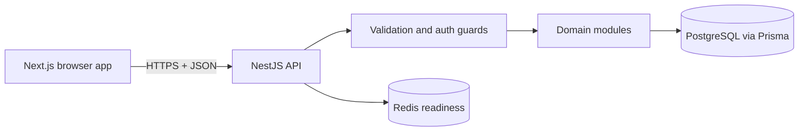

# EstateMint architecture v1

EstateMint is an npm-workspace monorepo with two independently deployable applications:

- a Next.js App Router frontend in `apps/web`
- a NestJS modular-monolith API at the repository root

The frontend is prepared for Netlify. The long-running API is deployed separately with PostgreSQL and Redis connectivity.

## API modules

### Auth and users

- public buyer registration and login
- bcrypt password hashing
- JWT bearer authentication and current-user lookup
- role metadata, authentication throttling, and safe user serialization
- internal user repository boundaries

### Properties

- public active-listing search, filtering, sorting, pagination, and details
- authenticated owner listing views
- seller, agent, and administrator publishing
- owner/administrator update and archive authorization

### Favorites

- authenticated, idempotent save/remove operations
- active-property shortlist views scoped to the current user

### Appointments

- authenticated tour requests for future times
- current-user tour history
- validation that prevents owners from touring their own listing

### Health and common infrastructure

- liveness and PostgreSQL/Redis readiness probes
- global request validation and a stable error envelope
- validated environment configuration
- Prisma lifecycle integration and OpenAPI documentation

## Request flow

The browser receives its API prefix from `NEXT_PUBLIC_API_BASE_URL`. Access tokens are sent in the `Authorization` header. Browser requests are restricted to `CORS_ALLOWED_ORIGINS`; credentialed cross-origin cookies are not used.

## Data ownership

- User identifiers come from verified JWTs, never protected client input.
- Property creation assigns the authenticated user as owner.
- Property update/archive checks owner identity or administrator role in the service layer.
- Favorite and appointment queries are always scoped by the authenticated user.
- Public property reads expose only active listings.

## Deployment boundaries

Netlify builds only `apps/web` through `npm run build:web` and serves the `.next` output with its current OpenNext adapter. The API Docker image runs `npm run build:api`; migrations are a separate release step.

PostgreSQL is the source of truth. Redis is currently an operational dependency/readiness target and is reserved for future shared throttling, revocation, caching, or notification coordination.

## Deliberate limitations

The current modular monolith is preferred over premature service extraction. Refresh tokens, media uploads, notification delivery, appointment status transitions, and a dedicated search index remain explicit future capabilities.
