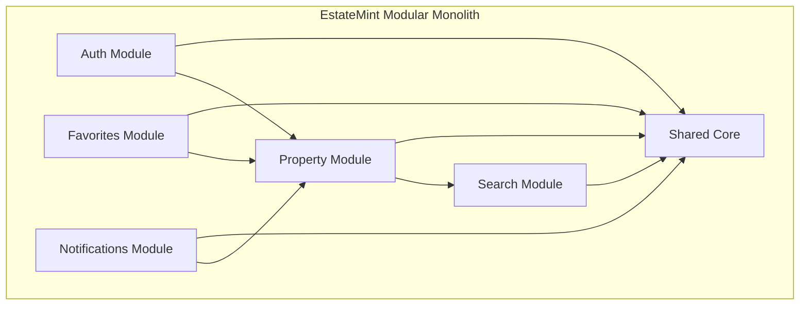
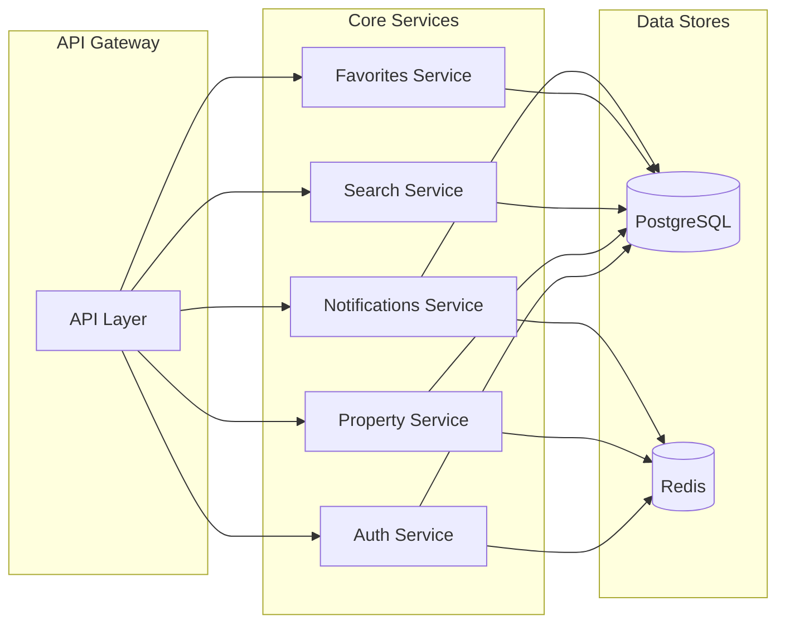

# EstateMint Architecture v1

EstateMint begins as a Modular Monolith designed with future service extraction in mind. This approach delivers a cohesive developer experience while preserving domain boundaries and scalability pathways.

## Modular Monolith Architecture

A modular monolith is a single deployed application with distinct, decoupled modules. EstateMint uses this pattern to keep the codebase manageable, reduce early operational complexity, and accelerate initial development.

Key characteristics:

- Single NestJS application entrypoint
- Domain-specific modules with explicit interfaces
- Shared core libraries for utilities, database access, and common services
- Clear asynchronous boundaries for non-blocking operations
- Architectural discipline to prevent cross-domain tight coupling

## Core Modules

### Auth

Responsibilities:

- User registration and login
- JWT authentication and refresh tokens
- Role-based authorization
- Password reset and account lifecycle management
- Session caching using Redis

### Users

Responsibilities:

- Provide the internal user domain foundation used by future authentication and authorization flows.
- Encapsulate user persistence behind a repository so feature modules do not query Prisma directly.
- Return safe user objects by default so password hashes do not leak into service responses.
- Support foundational operations such as lookup, creation, updates, and deactivation.

### Property

Responsibilities:

- Property creation, editing, and lifecycle transitions
- Ownership and agent assignment
- Property metadata and media attachments
- Publication status and archival workflows
- Administrative controls for listing validation

### Search

Responsibilities:

- Property discovery and filtering
- Query normalization and validation
- Pagination, sorting, and relevance ranking
- Search caching and performance optimization
- Future support for search indexing engines

### Favorites

Responsibilities:

- Save and revisit properties
- Persist favorite relationships per user
- Integrate with property views and listing summaries
- Support future watchlist and saved search experiences

### Notifications

Responsibilities:

- Event-driven notification orchestration
- In-app, email, and webhook notification channels
- Notification preference management
- Delivery status and retry semantics

## Future Migration Path to Microservices

The current design is intentionally modular so modules can be extracted into standalone services when the platform requires independent scaling.

Migration path:

1. Maintain shared contracts and DTOs within a common library.
2. Introduce API gateways or GraphQL federation for cross-module communication.
3. Extract stateful domain modules behind service APIs (e.g. Search Service, Notifications Service).
4. Replace in-process module calls with asynchronous messaging or HTTP calls.
5. Move shared persistence into dedicated stores only when necessary.

This path preserves the initial developer experience while enabling future operational flexibility.

## Architecture Diagrams

### High-Level Module Diagram

### Future Microservice Migration

## Deployment Considerations

- Docker is the primary packaging mechanism for local development and production deployment.
- PostgreSQL provides durable relational storage for marketplace data.
- Redis is used for caching, session state, and short-lived coordination.
- The monorepo structure enables shared libraries and consistent cross-module patterns.

## Operational Goals

- Start with a single deployable service to reduce configuration overhead.
- Keep modules independent enough that extraction does not require major refactors.
- Adopt infrastructure patterns that scale horizontally when load increases.
- Instrument the application with observability and traceability early in development.

EstateMint v1 is a practical, production-oriented architecture designed to bootstrap a scalable real estate marketplace while keeping future service evolution straightforward.
